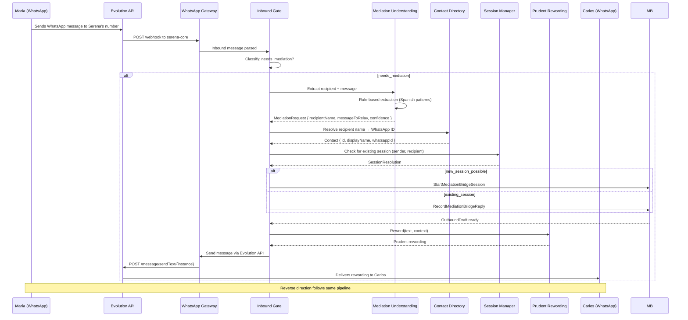
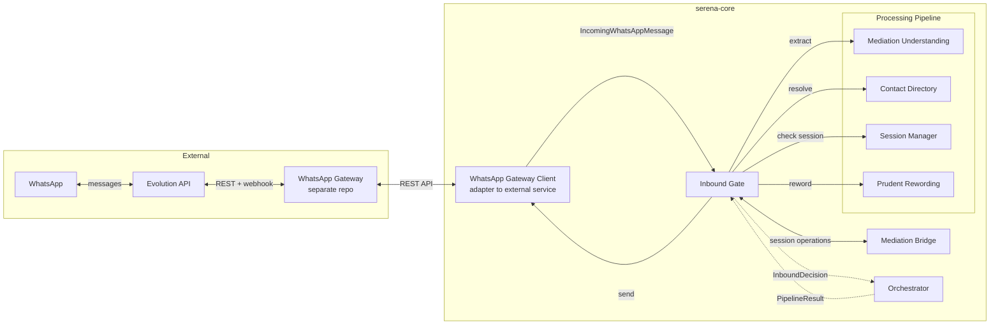
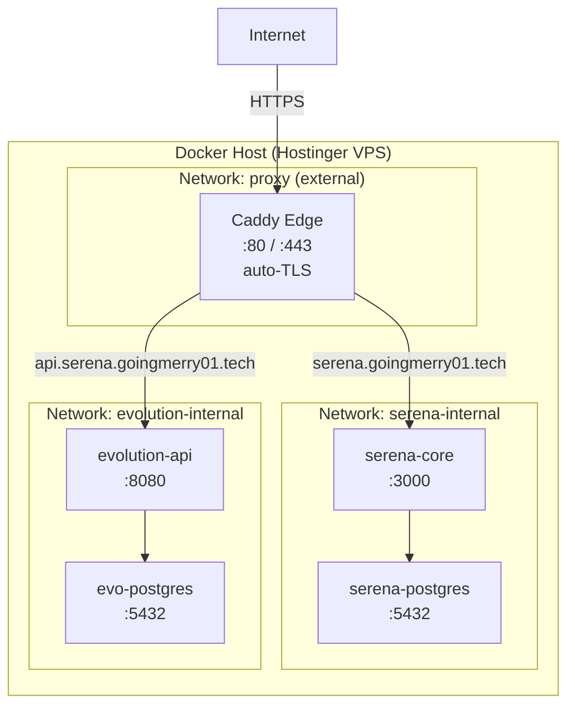

# T10 — MVP Architecture Design and Specification

> Status: confirmed with Marco
> Scope: design and contracts only — no runtime implementation, no deploy, no dependencies

---

## 1. Product Decisions

These decisions were confirmed with Marco and define the MVP scope:

| Decision | Detail |
|----------|--------|
| WhatsApp provider | Evolution API (self-hosted, Docker on same VPS) |
| WhatsApp number | Dedicated for Serena (Marco's number for testing) |
| Contact model | `{ id, displayName, whatsappId }` — no relationship field in MVP |
| Session rule | One active session per participant pair; if closed, new one starts |
| Rewording style | Indirect style, no invention, clear attribution ("María me pidió decirte que…") |
| Persistence | In-memory until pipeline end-to-end works, then PostgreSQL adapters |
| Understanding strategy | Rules first (Spanish patterns), LLM as fallback |
| Hosting | Evolution API self-hosted via Docker Compose on VPS at `/docker/evolution-api/` |

---

## 2. Module Inventory

| Module | Status | Description |
|--------|--------|-------------|
| `inbound-gate` | ✅ exists | Classifies inbound messages as conversational, mediation request, or blocked |
| `mediation-bridge` | ✅ exists | Manages session lifecycle, turns, outbound drafts, and closure between two participants |
| `contact-directory` | ❌ new — contracts only | Stores and resolves contacts (allowed senders + name-to-ID resolution) |
| `session-manager` | ❌ new — contracts only | Resolves active session for a participant pair or signals a new one is possible |
| `mediation-understanding` | ❌ new — contracts only | Extracts recipient name + message from natural language (rules first, LLM fallback) |
| `prudent-rewording` | ❌ new — contracts only | Rewords extracted message in indirect style with clear attribution |
| `whatsapp-gateway` | ❌ new — contracts only | Sends/receives WhatsApp messages via Evolution API REST + webhooks |
| `orchestrator` | ❌ new — contracts only | Wires the end-to-end pipeline: inbound → classify → understand → resolve → reword → send |

---

## 3. End-to-End Pipeline



---

## 4. Data Flow Diagram



### Data Contracts Between Modules

| From | To | Contract |
|------|----|----------|
| WhatsApp Gateway | Inbound Gate | `IncomingWhatsAppMessage` |
| Inbound Gate | Mediation Understanding | `text: string, senderId: string` → `MediationRequest \| null` |
| Inbound Gate | Contact Directory | `whatsappId: string` → `Contact \| undefined` |
| Inbound Gate | Session Manager | `senderWhatsAppId: string` → `SessionResolution` |
| Inbound Gate | Prudent Rewording | `originalText: string, RewordingContext` → `string` |
| Inbound Gate | WhatsApp Gateway | `toWhatsAppId: string, text: string` → `void` |

---

## 5. VPS Deployment Architecture

### VPS Resources

- **Server**: srv1619520.hstgr.cloud
- **Specs**: 2 vCPU, 8GB RAM, 96GB disk (~5.9GB RAM free)
- **IPv4**: 177.7.32.90
- **IPv6**: 2a02:4780:75:6109::1

### Container Layout



### Route Table

| Domain | Backend | Network |
|--------|---------|---------|
| `serena.goingmerry01.tech` | `serena-core:3000` | `proxy` |
| `api.serena.goingmerry01.tech` | `evolution-api:8080` | `proxy` |

### Deployment Paths

```text
/docker/caddy-edge/        ← Caddy edge proxy (existing)
/docker/serena/            ← serena-core + serena-postgres (existing, T04)
/docker/evolution-api/     ← Evolution API (future, managed by whatsapp-gateway repo)
/docker/whatsapp-gateway/  ← WhatsApp Gateway service (future, separate repo)
```

> ⚠️ Evolution API y WhatsApp Gateway serán desplegados por el repo separado `whatsapp-gateway`, no por Serena. El diagrama inferior muestra la arquitectura objetivo cuando todo esté desplegado.

### Port Exposure

| Service | Internal Port | Published |
|---------|--------------|-----------|
| Caddy | 80, 443 | Yes — routes externally |
| serena-core | 3000 | No — internal via proxy |
| serena-postgres | 5432 | No — internal via serena-internal |
| evolution-api | 8080 | No — internal via proxy |
| evo-postgres | 5432 | No — internal via evolution-internal |

---

## 6. Contact Data Model

```typescript
type Contact = {
  id: string;
  displayName: string;
  whatsappId: string;
};
```

### Relationship with Existing Port

The existing `ContactDirectory` port in `inbound-gate` only exposes:

```typescript
export type ContactDirectory = {
  hasAllowedSender(normalizedSenderId: string): Promise<boolean>;
};
```

This is insufficient for the mediation pipeline, which needs:
- Name-to-ID resolution (`findByWhatsAppId`)
- ID lookup (`findById`)
- Full contact listing (`findAll`)

The new `contact-directory` module defines an **expanded** port contract. When T12 implements this, the in-memory adapter will serve both the old port (via delegation) and the new one.

---

## 7. Session Manager Strategy

### Rule: One Active Session Per Pair

A pair is defined as `(requester WhatsApp ID, recipient WhatsApp ID)` — order doesn't matter (the pair `(A, B)` is the same as `(B, A)`).

**Resolution algorithm:**

1. When a message arrives from sender X containing a mediation request for recipient Y:
   - Look for an active (non-closed) session where X and Y are the requester and recipient (in either order)
2. If exactly one active session is found → `{ type: "existing_session", sessionId }`
3. If no active session is found → `{ type: "new_session_possible" }`
4. If multiple active sessions are found (should not happen with the one-per-pair rule) → use the most recent, log a warning
5. If sender not in any session and no mediation request is detected → `{ type: "no_active_session" }` (regular conversation, not mediation)

**Closed sessions are ignored.** A new mediation request for the same pair after a session was closed starts a fresh session.

---

## 8. Mediation Understanding Strategy

### Cascading Approach: Rules First, LLM as Fallback

**Step 1 — Rule-based extraction** (Spanish patterns):

| Pattern | Example | Extraction |
|---------|---------|-------------|
| `avisale a {NAME} que {MSG}` | "avisale a Carlos que llego tarde" | recipient="Carlos", message="llego tarde" |
| `decile a {NAME} que {MSG}` | "decile a María que la llamo mañana" | recipient="María", message="la llamo mañana" |
| `llamá a {NAME}` | "llamá a Carlos" | recipient="Carlos", message="llamá" |
| `escribile a {NAME}` | "escribile a María" | recipient="María", message="escribile" |
| `contactá a {NAME}` | "contactá a Juan" | recipient="Juan", message="contactá" |

When a rule matches:
- Confidence: `"high"`
- Source: `"rule"`

**Step 2 — LLM fallback** (future, not in MVP contracts but port is ready):
- If no rule matches, the text is sent to an LLM for structured extraction
- Confidence: `"medium"` (clear structure) or `"low"` (uncertain)
- Source: `"llm"`

**Step 3 — Return null if everything fails** — the message is treated as non-mediation.

---

## 9. Prudent Rewording Strategy

### Principle: Indirect Style, No Invention, Clear Attribution

The rewording is NOT interpretation, NOT summarization, NOT subjective. It delivers the message AS GIVEN, with explicit attribution.

**Template for first message (introduction):**

```
Hola {recipientName}, soy Serena. {requesterName} me pidió decirte que {message}
```

**Template for subsequent messages (non-introduction):**

```
{requesterName} me pidió decirte que {message}
```

### Rules

- ❌ No paraphrasing
- ❌ No interpretation of intent
- ❌ No summarization
- ❌ No adding context not in the original
- ✅ Literal relay of the message content
- ✅ Always include who the message is from
- ✅ Serena introduces herself only once per session (first message to recipient)

The `isRecipientIntroduction` flag in `RewordingContext` controls which template is used.

---

## 10. WhatsApp Gateway Contract

> ⚠️ WhatsApp Gateway será un **servicio independiente** en un repo separado (`whatsapp-gateway`). Serena interactúa con él a través de un client adapter, no directamente con Evolution API.

### WhatsApp Gateway Service (external repo)

The WhatsApp Gateway is a standalone Docker service that:
- Manages multiple Evolution API instances (one per WhatsApp number)
- Exposes a REST API for sending messages
- Routes incoming webhooks to subscriber projects
- Supports both dedicated and shared numbers per project
- Is agnostic to project-specific business logic

### Serena Client Adapter

Serena's `WhatsAppGateway` port contract remains unchanged. The adapter implementation will call the WhatsApp Gateway REST API instead of Evolution API directly.

### API Methods Used

| Action | Method | Endpoint |
|--------|--------|----------|
| Create instance | POST | `/instance/create` |
| Connect instance | POST | `/instance/connect/{instance}` |
| Send text message | POST | `/message/sendText/{instance}` |
| Receive messages | Webhook | POST to serena-core (configured per instance) |

### Webhook Events (Inbound)

Evolution API POSTs webhooks to serena-core for these events:

| Event | Trigger |
|-------|---------|
| `messages.upsert` | New message received |
| `connection.update` | Connection status changed |
| `qrcode.updated` | QR code generated/updated for pairing |

The WhatsApp Gateway adapter:
- Parses `messages.upsert` into `IncomingWhatsAppMessage`
- Ignores messages sent by Serena herself (self-messages)
- Provides `onMessage()` for registering a handler

### Instance Management

- One Evolution API instance per Serena WhatsApp number
- Instance is created once, then connected
- If the instance disconnects, it reconnects automatically
- QR code or pairing code is used for initial WhatsApp Web linking

---

## 11. Task Roadmap

### Decisions

- **WhatsApp Gateway será un repo separado** (`whatsapp-gateway`) — servicio agnóstico que administra múltiples números de WhatsApp via Evolution API. Cualquier proyecto (Serena, Hermes, futuro) puede enviar/recibir mensajes sin depender de Serena. Se implementará después de completar la lógica de negocio de Serena.
- **Serena MVP sin integraciones reales** — se implementa el pipeline completo con adaptadores in-memory, tests end-to-end, y recién después se conectan WhatsApp Gateway y PostgreSQL.

### Current Tasks (Serena business logic — in-memory)

| Task | Description | Dependencies |
|------|-------------|--------------|
| **T11** | Contact Directory — expanded in-memory adapter + JSON seed + use case | T10 contracts |
| **T12** | Mediation Understanding — rule-based extraction (Spanish patterns) | T10 contracts |
| **T13** | Prudent Rewording — template-based indirect rewording | T10 contracts |
| **T14** | Session Manager — resolve active session per participant pair | T10 contracts, T11 |
| **T15** | Orchestrator — wire the end-to-end pipeline with in-memory adapters | T06–T14 |
| **T16** | End-to-end integration tests — full pipeline verification | T11–T15 |

### Future Tasks (after Serena pipeline works)

| Task | Description | Dependencies |
|------|-------------|--------------|
| **T17** | WhatsApp Gateway repo — standalone service, multi-project, multi-number | T16 |
| **T18** | Serena WhatsApp adapter — connect serena-core to WhatsApp Gateway | T17 |
| **T19** | PostgreSQL adapters — replace in-memory with real DB | T16 |
| **T20** | VPS deployment update — WhatsApp Gateway + Serena behind Caddy | T17, T18 |

---

*Document created during T10. Last updated: 2026-05-02.*
